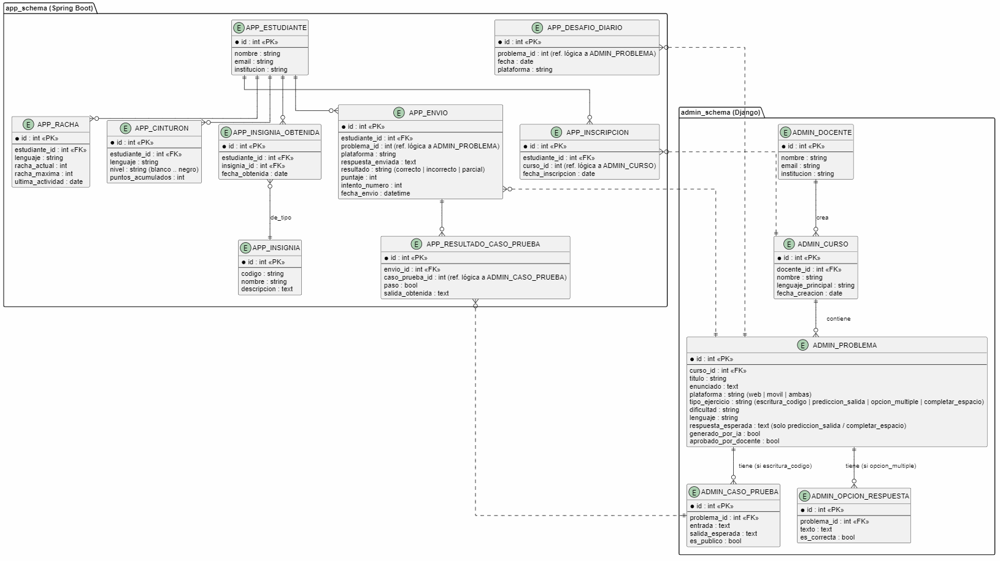

>El siguiente modelo es preliminar y consistente con ADR-1 (dos esquemas separados) y con la sección 5.1 (plataforma / tipo_ejercicio). Los prefijos ADMIN_ y APP_ indican qué esquema/servicio es dueño de cada tabla. Las relaciones punteadas en el diagrama original representan referencias lógicas, no llaves foráneas físicas: Usuario nunca declara una FK dentro del esquema de Administración (ni viceversa), para no acoplar las migraciones de Django y Flyway (ver ADR-1); esa referencia se valida a nivel de aplicación, llamando a la API interna del otro servicio.

**

## Notas sobre el modelo

- ADMIN_PROBLEMA es la tabla central del lado docente: según tipo_ejercicio, se apoya en ADMIN_CASO_PRUEBA (solo para escritura_codigo, Web), en ADMIN_OPCION_RESPUESTA (solo para opcion_multiple, Móvil), o solo usa su propio campo respuesta_esperada (para prediccion_salida / completar_espacio, Móvil) — evita crear una tabla separada para cada tipo cuando el dato es un único valor.

- No existe una tabla "Usuario" compartida: el JWT que emite Django (ADR-4) usa el mismo identificador (email) para reconocer a la persona en ambos esquemas, pero ADMIN_DOCENTE y APP_ESTUDIANTE son perfiles independientes, cada uno dueño de su esquema.

- APP_RACHA, APP_CINTURON, APP_INSIGNIA* y APP_DESAFIO_DIARIO son las tablas de las mecánicas de engagement estilo Consoly (sección 5.1) — pertenecen solo a Móvil.

- Es un modelo preliminar: se termina de afinar en el Épico E1 (Fase 2), cuando se implementen los modelos reales en Django y Spring Boot.